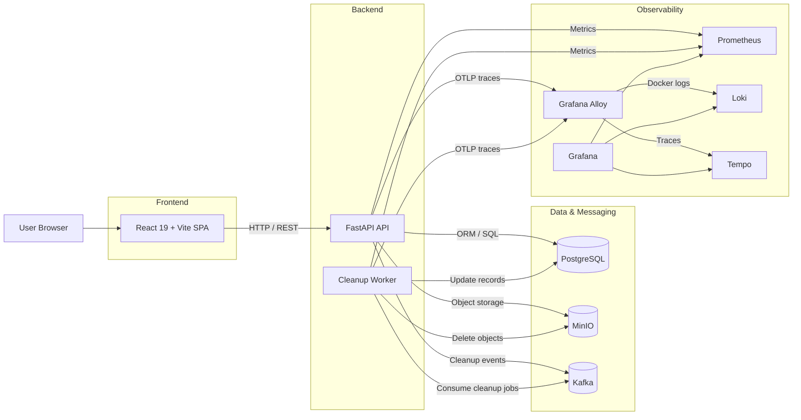

# FileSh

FileSh is a full-stack file sharing application with authenticated workspaces, shareable links, object storage, and built-in observability.

The repository contains:

- `frontend/`: React 19 + Vite client application
- `backend/`: FastAPI service, domain logic, and cleanup worker
- `infra/`: Grafana, Prometheus, Loki, Tempo, and Alloy configuration

## Highlights

- User registration, login, refresh-token sessions, logout, password change, and account deletion
- Personal workspace with folders, files, search, sorting, move, rename, and delete actions
- Public or restricted sharing for files and folders
- Shared-link flows with permission-aware upload and delete operations
- PostgreSQL persistence, MinIO object storage, Kafka-based cleanup events, and OpenTelemetry instrumentation

## Architecture

- Frontend: React 19, TypeScript, Vite, Tailwind CSS v4, shadcn/ui, Zustand, Zod
- Backend API: FastAPI, SQLAlchemy, Alembic, JWT auth, bcrypt, MinIO SDK, Kafka
- Data services: PostgreSQL, MinIO, Kafka
- Observability stack: Grafana, Prometheus, Loki, Tempo, Alloy



## Quick Start

### 1. Create local environment values

```bash
cp .env.example .env
```

Update at least these secrets before sharing or deploying:

- `JWT_SECRET`
- `SHARE_TOKEN_SECRET`
- `GRAFANA_ADMIN_PASSWORD`

### 2. Start the full stack

```bash
make up
```

This starts:

- frontend dev server on `http://localhost:5173`
- backend API on `http://localhost:8000`
- Swagger UI on `http://localhost:8000/docs`
- Grafana on `http://localhost:3000`
- Prometheus on `http://localhost:9090`
- MinIO API on `http://localhost:9000`
- MinIO console on `http://localhost:9001`

### 3. Stop services

```bash
make down
```

## Common Commands

```bash
make up
make down
make logs
make ps
make backend
make frontend
make migrate
make test
make lint
make format
```

## Repository Layout

```text
.
|-- backend/      FastAPI app, Alembic migrations, tests, cleanup worker
|-- frontend/     React app and UI components
|-- infra/        Observability and monitoring configuration
|-- docker-compose.yml
|-- Makefile
`-- .env.example
```

## Development Notes

- The backend container runs `uv sync`, applies Alembic migrations, and starts Uvicorn with reload.
- The frontend container runs `pnpm dev --host 0.0.0.0 --port 5173`.
- MinIO bucket bootstrap is handled by the `minio-init` service.
- Kafka is used for cleanup/event processing, and `cleanup-worker` runs separately from the API service.

## Testing And Quality

Backend checks are wired through Docker and local `uv` commands:

```bash
make test
make lint
make format
make pre-commit-install
make pre-commit-run
```

The frontend currently exposes build and type-check scripts inside `frontend/package.json`.

## Additional Docs

- [Frontend README](./frontend/README.md)
- [Backend README](./backend/README.md)
